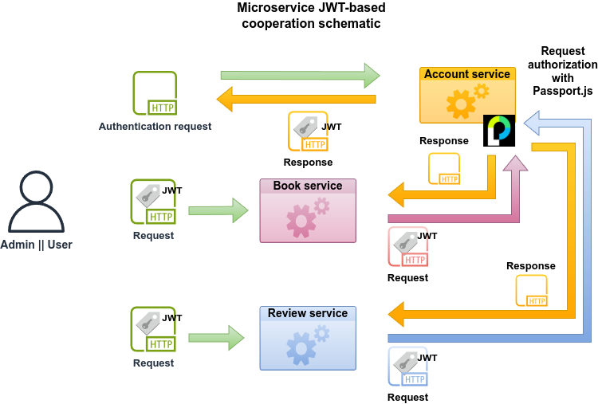

# nodejs-typescript-book-review

## About the project

Contains the backend implementation of a Book Review app. At its core, the app allows a user to register and, after a successful login, post a review for a book whose information is stored in the database.

The implementation uses an approach that combines RESTful endpoints with microservices. There are 3 services, namely the **Account**, **Book**, and **Review** services. The central role is played by the **Account** service, which receives and processes:

- user registration requests,
- user authentication requests,
- user authorization requests.

The registration and authentication requests come from the client, while the authorization requests come from the client as well as the **Book** and **Review** services.

Each service exposes a number of RESTful endpoints for use by the client, depending on the client's role:

- **Admin role**

  - Account service
    - User info update,
    - User info retrieval
  - Book service
    - Author info addition,
    - Author info update,
    - Author info retrieval by ID,
    - Book info addition,
    - Book info update,
    - Book info retrieval by ID,
    - BookAuthor info addition,
    - Edition info addition,
    - Edition info update,
    - Edition info retrieval by book,
    - Edition info retrieval by ISBN

- **User role**
  - Account Service
    - User info update,
    - User info retrieval,
    - Personal info addition,
    - Personal info update,
    - Personal info retrieval by username
  - Book service
    - Book info retrieval by title,
    - Book info retrieval by genre,
    - Full (book + author + edition) book info retrieval by ID
  - Review service
    - Review info addition,
    - Review info update,
    - Review info retrieval by ID,
    - Review info retrieval by book,
    - Review info retrieval by username,
    - Review info retrieval by (composite) index

The following endpoints are open to all users, irrespective of their role:

- User registration,
- User login

Finally, the **Account** service exposes an inter-service endpoint to accommodate requests for user authorization by the **Book** and **Review** services.

## Prerequisites

- Nodejs (v22.13.1)[^1],
- Redis server (v7.4.2),
- MongoDB,
- MySQL (v8 or higher).

## Security

- **Authentication**: Single factor, local authentication.
- **Authorization**: JSON Web Token (JWT).

##

[^1]: According to the [Release Schedule](https://nodejs.org/en/about/previous-releases), Node.js v22 will enter its maintenance phase in the last quarter of 2025. During that period, it is recommended that the project should migrate to the latest active LTS version.

        

